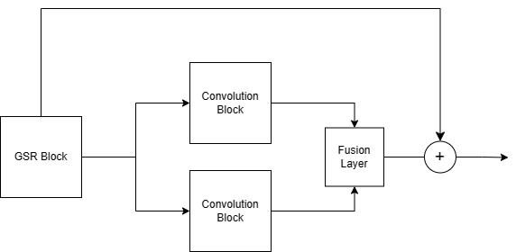
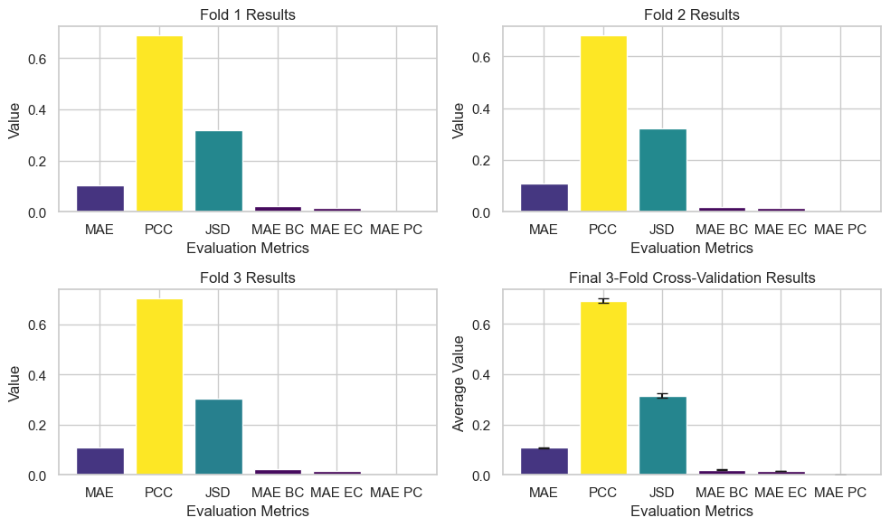

# Brain Graph Super-Resolution

## Problem Description
The brain graph super-resolution problem aims to generate high-resolution brain graphs from low-resolution counterparts. Brain graphs, or connectomes, are illustrations of the neuronal connections inside the brain, where nodes represent regions of interest (ROIs) and edges represent the connections or pathways between these regions. Generating high-resolution brain graphs is crucial for diagnosing brain disorders and deepening our understanding of brain structure. However, acquiring high-resolution MRI scans is costly and requires expensive sensors. In this project, we explore the use of Graph Generative Models to extract high-definition connectomes from low-resolution scans.

## DualSRAtt-Net - Methodology
DualSRAtt-Net is a generative graph neural network model designed for brain graph super-resolution. The key components of our model include:
- Graph Super Resolution (GSR) block: Generates a matrix that spectrally resembles the high-resolution graph using input graph features.
- Graph U-Net: A U-Net-like architecture adapted for graph data, which processes the normalized adjacency matrix and identity matrix to produce intermediate outputs.
- Self-Attention and Multi-Head Attention: Incorporated to capture dependencies between nodes and enhance the model's representational power.
- Dual Paths: Two separate convolution blocks process the GSR output and attention layer outputs, and their results are fused using an MLP.
- Adversarial Regularization: A discriminator network is used during training to distinguish between generated and ground truth graphs, improving the quality of the generated graphs.



## Used External Libraries
To run the code, please install the following libraries:
- PyTorch
- NumPy
- Matplotlib
- Scikit-learn
- SciPy
- NetworkX
- Seaborn
- Pandas

You can install these libraries using pip:
```
pip install torch numpy matplotlib scikit-learn scipy networkx seaborn pandas
```

## Setup
1. Create a `csvs` folder in the project directory to store the generated predictions.
2. Update the `PATH` and `MAT_PATH` variables in the code to point to the correct locations of your data files.

## Results


## References
- [GSRNet: Graph Super-Resolution Network](https://arxiv.org/abs/2009.11080)
- [AGSR: Adversarial Graph Super-Resolution](https://arxiv.org/abs/2105.00425)
- [How Powerful are Graph Neural Networks?](https://arxiv.org/abs/1810.00826)
